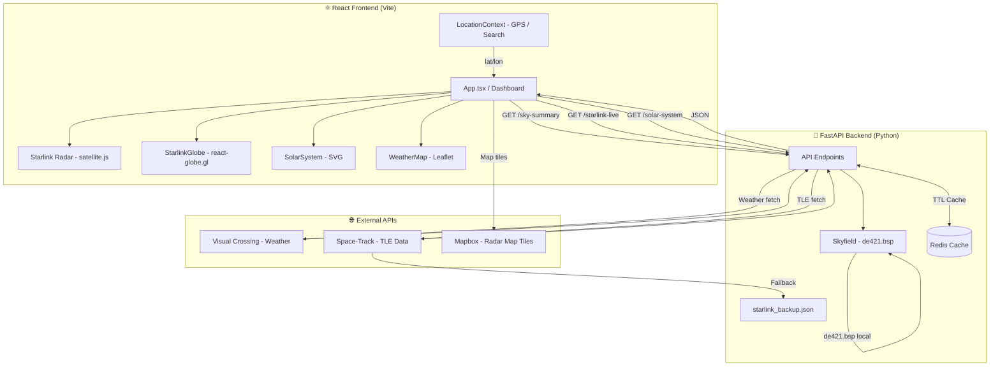
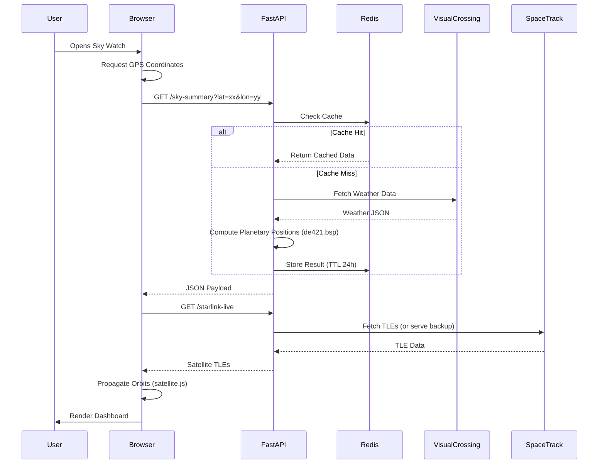

# Sky Watch Telemetry Dashboard

A high-precision, observatory-style dashboard featuring real-time astronomical tracking and local weather synchronization.

## Getting Started

Live Demo: [skywatchdash.com](https://www.skywatchdash.com)

This application is fully containerized using **Docker** and **Docker Compose**. This ensures sub-millisecond astronomical accuracy and environmental parity across all platforms.

### Prerequisites

* **Docker Desktop**: Must be installed and running
* **Weather API Key**: Sign up for a free key at [Visual Crossing Weather](https://www.visualcrossing.com/weather-api).
### Infrastructure Services
This project uses **Docker Compose** to automatically orchestrate the following services:

* **FastAPI (telemetry-api):** The core Python engine running on port `8000`.
* **Redis (cache):** An in-memory data store used for telemetry caching.
    * **Image:** `redis:7-alpine`
    * **Internal Port:** `6379`
    * **Purpose:** Mitigates API rate limits by caching astronomical vectors and weather data for 24 hours.

### Local Installation
1. **Clone & Navigate:**
   ```bash
   git clone [https://github.com/DavidBBrand/sky-watch.git]
   cd sky-watch
### Frontend Setup (React + Vite)
```bash
cd skyapp-frontend
npm install
npm run dev
```
### BACKEND SETUP (Docker)
from the root directory containing the docker-compose.yml file, run:
```bash
docker-compose up --build
```

## 🛰️ System Architecture


## ⏱️ Timing Diagram


