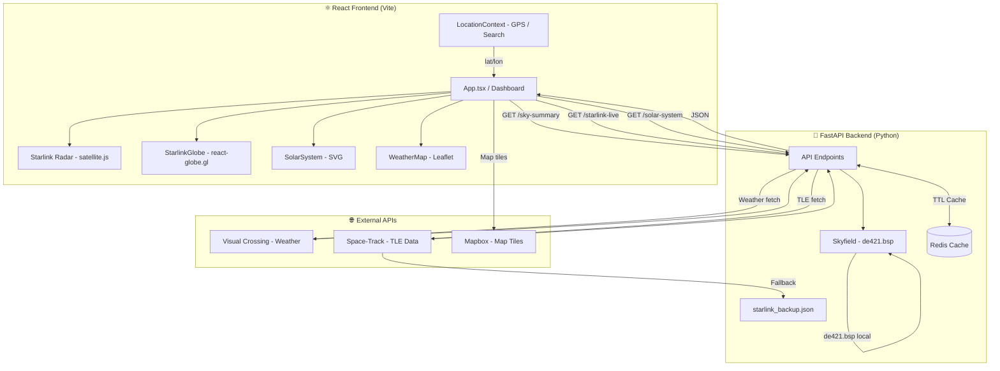
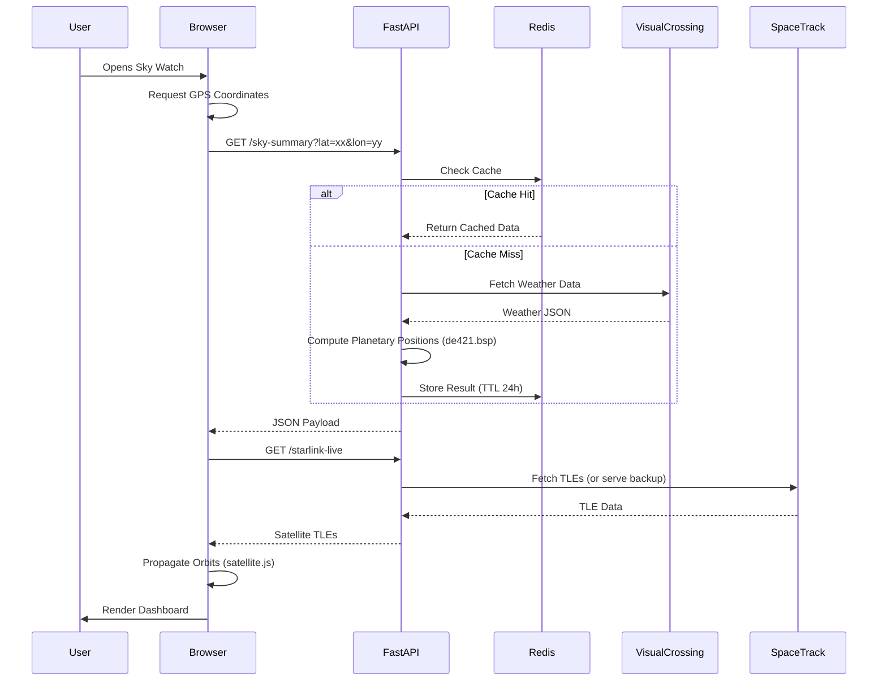

# Sky Watch Telemetry Dashboard

A high-precision, observatory-style dashboard featuring real-time astronomical tracking and local weather synchronization.

## Live App

[skywatchdash.com](https://www.skywatchdash.com)

---

## Getting Started

This application is fully containerized using **Docker** and **Docker Compose**, ensuring environmental parity across all platforms. Astronomical accuracy is provided by the **Skyfield** library and the JPL DE421 ephemeris.

### Prerequisites

- **Docker Desktop** — must be installed and running
- **Weather API Key** — free key from [Visual Crossing Weather](https://www.visualcrossing.com/weather-api)
- **Mapbox Token** — free key from [Mapbox](https://account.mapbox.com/)
- **OpenWeather API Key** — free key from [OpenWeatherMap](https://openweathermap.org/api) (used for the cloud overlay map)

---

## Environment Variables

The project requires two separate `.env` files — one for the backend (Docker) and one for the frontend (Vite). Neither file is committed to version control.

### Root `.env` (backend / Docker Compose)

Create a file named `.env` in the root directory (same level as `docker-compose.yml`):

```env
WEATHER_API_KEY=your_visual_crossing_key_here
```

### `skyapp-frontend/.env` (frontend / Vite)

Create a file named `.env` inside the `skyapp-frontend/` directory:

```env
VITE_API_URL=http://127.0.0.1:8000
VITE_MAPBOX_TOKEN=your_mapbox_token_here
VITE_WIND_MAP_KEY=your_openweather_key_here
VITE_NOMINATIM_EMAIL=your_email_here
```

> `VITE_NOMINATIM_EMAIL` is used as the User-Agent for the Nominatim geocoding API (location search). Any valid email works; if omitted, requests are sent anonymously.

---

## Local Installation

### 1. Clone the Repository

```bash
git clone https://github.com/DavidBBrand/sky-watch.git
cd sky-watch
```

### 2. Backend (Docker)

From the root directory (containing `docker-compose.yml`):

```bash
docker-compose up --build
```

This starts the FastAPI backend on port `8000` and a Redis cache on port `6379`.

### 3. Frontend (React + Vite)

In a separate terminal:

```bash
cd skyapp-frontend
npm install
npm run dev
```

---

## Infrastructure Services

Docker Compose orchestrates the following services:

- **FastAPI (`telemetry-api`)** — core Python engine on port `8000`
- **Redis (`cache`)** — in-memory store (`redis:7-alpine`) on port `6379`, used to cache astronomical calculations and weather data and mitigate API rate limits

---

## System Architecture



---

## Timing Diagram


